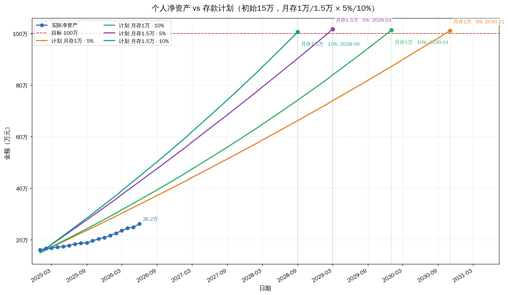
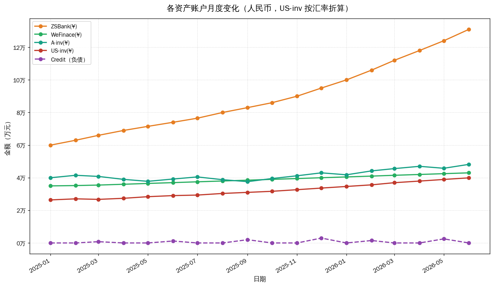
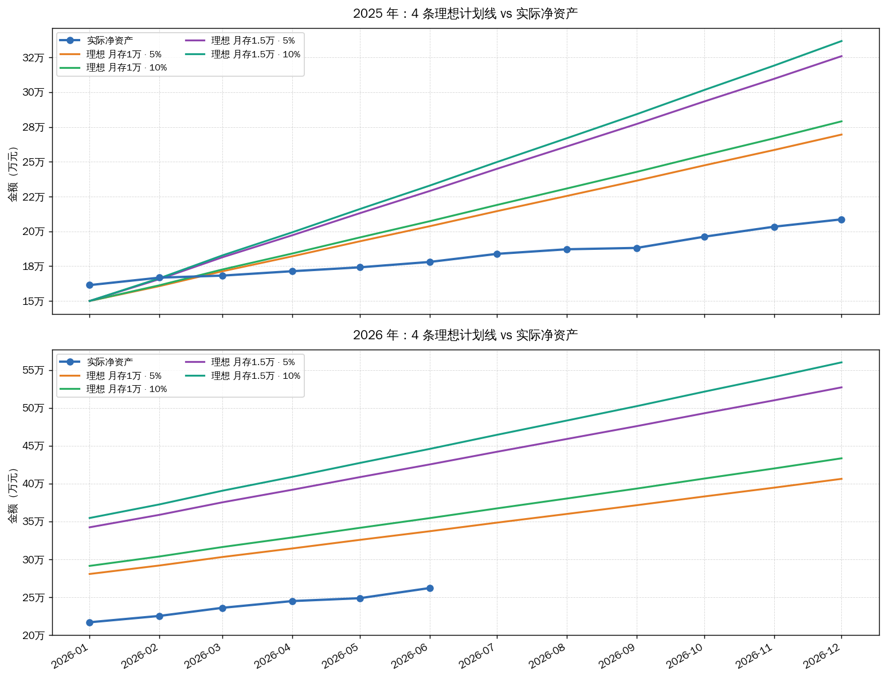
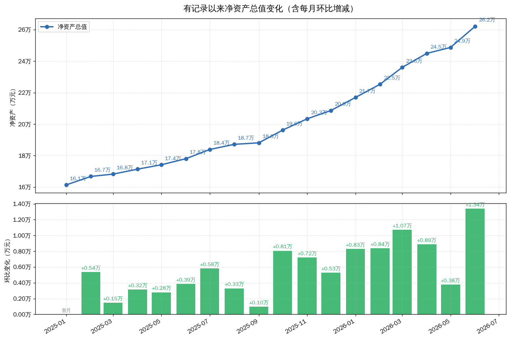

# 个人资产增长与百万目标可视化

把「实际净资产变化」和「存款计划曲线」画在一起，并计算净资产何时达到 100 万。

## 效果预览

> 下面 4 张图全部由 `examples/sample_data.xlsx` 里的**虚构示例数据**生成，不对应任何真实账户。
> 复现方式：`python examples/make_sample_data.py` 生成数据，再执行
> `python main.py --file examples/sample_data.xlsx --sheet record`。

**主图：实际净资产 + 4 条存款计划曲线 + 100 万目标线**



**账户月度变化：各资产/负债账户逐月走势**



**逐年对比：每个年度内 4 条理想计划线 vs 实际净资产**



**净资产总值与每月环比增减**



## 功能
- 从外部文件（默认 `/mnt/d/learning.xlsx` 的 `record` sheet）读取每月 1 号的资产负债记录，计算净资产
- **支持 Excel 与 CSV 两种数据源**，按文件扩展名自动识别，CSV 会自动处理 UTF-8 / GBK 编码与分隔符
- 净资产 = Σ(资产列 × 汇率) − Σ(负债列)，美股（US-inv）按 6.6 汇率折算成人民币
- **主图**：实际净资产 + 4 条计划曲线（月存 1万/1.5万 × 年化 5%/10%，月复利、月初存入）+ 100 万目标线 + 达标日期标注
- **账户趋势图**：有记录以来各资产/负债账户的月度变化（US-inv 折算人民币）
- **逐年对比图**：每个有记录的年度内，4 条理想计划线 vs 实际净资产线

## 安装依赖
```bash
pip install -r requirements.txt
```

## 使用
```bash
# 1) 首次使用：在指定路径生成示例模板（不放在项目内）
python main.py --init-template /你的路径/template.xlsx   # 生成 Excel 模板
python main.py --init-template /你的路径/template.csv    # 生成 CSV 模板（同样可用）

# 2) 按每月 1 号填写资产/负债后，运行：
python main.py                              # 使用 config.py 里的 ASSET_FILE
python main.py --file /你的路径/learning.xlsx --sheet record   # 指定 Excel 与 sheet
python main.py --file /你的路径/learning.csv                   # 指定 CSV

# 3) 输出
#    控制台：各场景达标日期/所需月数
#    图片：output/net_asset_plan.png（主图）、accounts_trend.png（账户变化）、
#         yearly_compare.png（逐年对比）、net_assets_delta.png（净资产总值+每月环比）
```

## 数据格式（Excel / CSV）

程序只读一个数据文件，**按扩展名自动识别**：

| 扩展名 | 读取方式 | 说明 |
|---|---|---|
| `.xlsx` / `.xlsm` / `.xls` | `pandas.read_excel` | 默认取名为 `record` 的 sheet，可用 `SHEET` 或 `--sheet` 改 |
| `.csv` / `.txt` / `.tsv` | `pandas.read_csv` | 没有工作表概念，`--sheet` 会被忽略 |

**两种格式的表结构完全一样：第一行是表头，从第二行起每月 1 号一行**；行序无所谓，程序会按月排序，并丢弃日期为空的行。

CSV 的几点补充：

- **编码自动识别**：先按 BOM 判断（UTF-8 / UTF-16 / UTF-32），没有 BOM 时先试 UTF-8，失败再退回 GB18030。中文版 Excel「另存为 CSV」默认就是 GBK 系，可以直接读。
- **分隔符**：默认按逗号切；如果只切出一列，会自动嗅探分号或制表符。
- **`Sum` 列**：Excel 模板里 `Sum` 是公式，CSV 模板里只能写成算好的数值，两种程序都认。
- [`examples/sample_data.csv`](examples/sample_data.csv) 是一份可以直接对照的示例。

| 列名 | 类型 | 必填 | 说明 |
|---|---|---|---|
| `日期` | 日期 | ✅ | 每月 1 号记一次；同时作为计划曲线的起始点 |
| `ZSBank` | 数值 | ✅ | 资产，人民币 |
| `WeFinace` | 数值 | ✅ | 资产，人民币 |
| `A-inv` | 数值 | ✅ | 资产，人民币 |
| `US-inv` | 数值 | ✅ | 资产，**美元**，按 `FX_RATES` 折算成人民币 |
| `Credit` | 数值 | ✅ | 负债，人民币；无负债填 0 |
| `Sum` | 数值/公式 | 可选 | 若存在，会与程序算出的净资产比对，偏差超过 1 元就在控制台提示 |

净资产的计算规则：

```
净资产 = (ZSBank + WeFinace + A-inv + US-inv × 6.6) − Credit
```

几个要点：

- **列名不用和上表完全一致**。改 `src/config.py` 里的 `DATE_COL` / `ASSET_COLUMNS` / `LIABILITY_COLUMNS` 即可，汇率改 `FX_RATES`。
- **资产列可自由增删**：加进 `ASSET_COLUMNS` 图表里就多一条线；只有出现在 `FX_RATES` 里的列才会乘汇率，其余按 1 处理。
- **空白单元格按 0 计**，所以中途才开始记录的账户可以直接留空。
- **缺列会直接报错退出**，并打印文件里实际有哪些列，方便对着改。

对应的示例数据（和 `examples/sample_data.xlsx` / `.csv`、`python main.py --init-template template.xlsx` 生成的结构一致）：

| 日期 | ZSBank | WeFinace | A-inv | US-inv | Credit | Sum |
|---|---|---|---|---|---|---|
| 2026-01-01 | 60000 | 35000 | 40000 | 4000 | 0 | 161400 |
| 2026-02-01 | 62000 | 36000 | 41000 | 4200 | 2000 | 164720 |
| 2026-03-01 | 65000 | 37000 | 42000 | 4500 | 3000 | 170700 |

## 配置文件 `src/config.py`
| 项 | 说明 | 默认值 |
|---|---|---|
| `ASSET_FILE` | 资产负债文件路径（项目外） | `/mnt/d/learning.xlsx` |
| `SHEET` | 读取的 sheet 名 | `record` |
| `ASSET_COLUMNS` | 资产列 | `ZSBank, WeFinace, A-inv, US-inv` |
| `FX_RATES` | 外币资产列 → 汇率 | `{"US-inv": 6.6}` |
| `LIABILITY_COLUMNS` | 负债列 | `Credit` |
| `INITIAL_BALANCE` | 计划初始本金 | `150_000` |
| `PLAN_SCENARIOS` | 计划场景列表（月存 × 年化） | 1万/1.5万 × 5%/10% |
| `TARGET` | 目标净资产 | `1_000_000` |

## 算法说明
- 有效月利率：`r = (1 + 年化)^(1/12) − 1`
- 逐月递推（月初存入、月复利）：`余额[t] = (余额[t-1] + 月存款) × (1 + r)`
- 首次 `余额 >= 100 万` 的月份即为达标月
